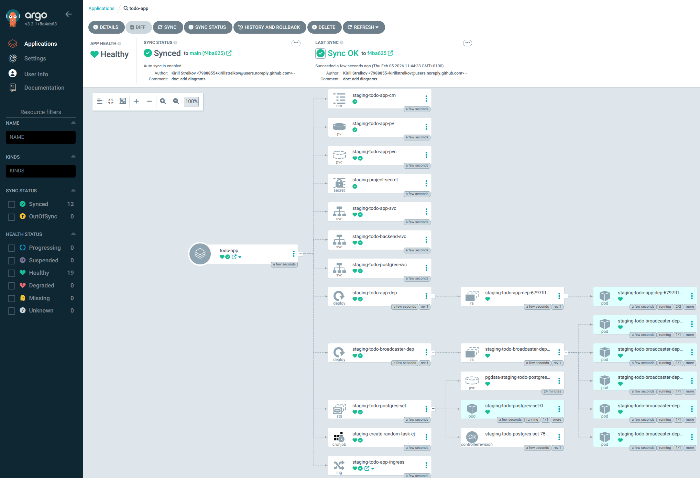
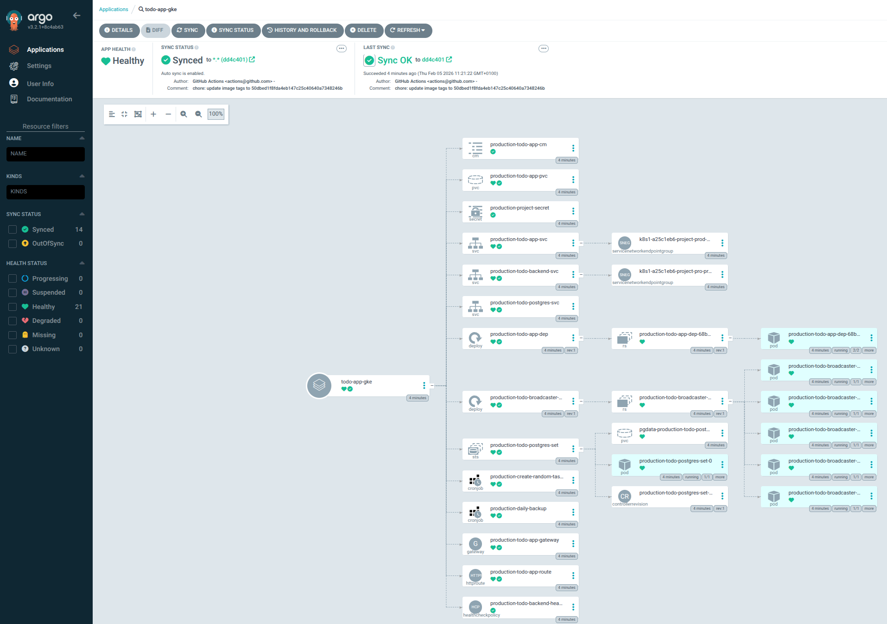

# GitOps for todo app

Todo app can be found <https://github.com/kirillstrelkov/KubernetesSubmissions/>

This repo contains config for Kubernetes.

## Overview

### Staging


### Production


## ArgoCD applications

Create ArgoCD applications

```bash
make argocd
```

### Staging



### Production


